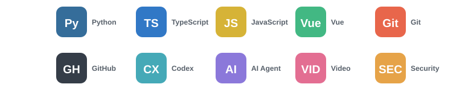
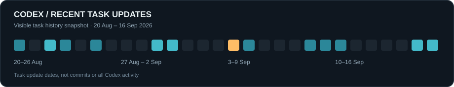

# Ryan Zhu · 创野小朱

#### AI Science Creator · Cybersecurity @ Johns Hopkins University · Builder

  
  
  

---

### 🚀 “把复杂的 AI 讲清楚，把有价值的想法做出来。”

*Explain complex AI clearly. Turn useful ideas into working products.*

<table width="100%">
  <tr>
    <td width="57%" valign="top">
      <h2>👋 Who I Am</h2>
      
我是 <strong>Ryan Zhu（创野小朱）</strong>，毕业于 <strong>Johns Hopkins University</strong>，专业是<strong>网络安全</strong>，现居<strong>南京</strong>。

      
我正在创作 <strong>AI 科普内容</strong>：通过故事、实验和动画，把大模型、Agent 与安全技术讲得准确而易懂。我也参与软件产品的设计和实现，关注创作流程与真实业务场景中的效率问题。

    </td>
    <td width="43%" valign="top">
      <h2>⚡ At a Glance</h2>
      <pre><code>name:     Ryan Zhu / 创野小朱
school:   Johns Hopkins University
major:    Cybersecurity
location: Nanjing, China
role:     AI Science Creator
focus:    AI · Security · Product</code></pre>
    </td>
  </tr>
</table>

---

## 🔭 Currently Building & Exploring

<table width="100%">
  <tr>
    <td width="50%" valign="top">
      <h3>🛠️ Building</h3>
      <ul>
        <li>创作 AI 科普视频，把复杂概念转化为易懂的故事和画面</li>
        <li>打磨从选题、脚本、分镜到素材与动画的制作流程</li>
        <li>参与无人机巡检平台等产品的功能设计与迭代</li>
      </ul>
    </td>
    <td width="50%" valign="top">
      <h3>🌱 Exploring</h3>
      <ul>
        <li>AI Agent 的可靠性、边界与安全评估</li>
        <li>用 Codex 和可复用工作流连接创意与交付</li>
        <li>让 AI 实验过程更可观察、更容易复现</li>
      </ul>
    </td>
  </tr>
</table>

---

## 🧰 Tech & Creative Stack

|  | 常用工具与方法 |
| --- | --- |
| 🧠 **Engineering** | Python · TypeScript / JavaScript · Vue · Git / GitHub |
| 🤖 **AI Workflow** | Codex · AI Agent · 可复用创作流程 |
| 🎨 **Content Creation** | 技术拆解 · 脚本 · 分镜 · 动画素材 |
| 🛡️ **Security** | 网络安全研究 · AI 安全议题 |

---

## 🏗️ Selected Work & Projects

| 🔗 Project | 🎯 Focus | 🛠️ My Contribution |
| --- | --- | --- |
| **无人机巡检平台** | 无人机与机场协同的巡检业务 | 参与直播回传、机场控制界面，以及动态接口与菜单权限等功能的设计和迭代。 |
| **AI 科普视频与创作工作流** | AI 与安全主题的可视化表达 | 从选题和口播稿到分镜与动画素材，建立可复用的制作流程，并持续改进相关工具。 |
| [AI-Jailbreak-Paper](https://github.com/serarcherryan/AI-Jailbreak-Paper) | 大模型越狱与安全对齐 | 整理相关论文，记录方法、局限与后续问题。 |
| [OpenClaw-Security-Paper](https://github.com/serarcherryan/OpenClaw-Security-Paper) | AI Agent 安全研究 | 汇集论文摘要与研究观察。 |

---

## 📌 Featured Projects

<table width="100%">
  <tr>
    <td width="50%" valign="top"><strong>🚁 无人机巡检平台</strong> 巡检业务 · 直播回传 · 机场控制 · 权限设计</td>
    <td width="50%" valign="top"><strong>🎬 AI 科普创作</strong> 技术拆解 · 故事设计 · 分镜 · 动画工作流</td>
  </tr>
  <tr>
    <td width="50%" valign="top"><strong>🛡️ <a href="https://github.com/serarcherryan/AI-Jailbreak-Paper">AI Jailbreak Paper</a></strong> 大模型安全与对齐研究资料</td>
    <td width="50%" valign="top"><strong>🤖 <a href="https://github.com/serarcherryan/OpenClaw-Security-Paper">OpenClaw Security Paper</a></strong> AI Agent 安全论文与观察</td>
  </tr>
</table>

---

## 📊 GitHub Activity

公开项目与代码记录分布在 [@serarcherryan](https://github.com/serarcherryan?tab=repositories) 和当前账号 [@CinnabarStorm](https://github.com/CinnabarStorm?tab=repositories)。[查看过往账号的 GitHub 贡献图](https://github.com/serarcherryan#user-activity-overview)。

---

## 🐍 Contribution Journey

GitHub 记录公开项目，Codex 记录需求拆解、设计、实现、素材制作与迭代。下面是 **Codex 可访问任务的近期更新日快照**，与 GitHub 提交次数口径不同。

<strong>查看部分 Codex 工作记录与统计说明</strong>

| 最近更新 | 任务 | 主题 |
| --- | --- | --- |
| 2026-09-16 | 设计斗地主 AI 综艺分镜 | AI 竞技内容与视频叙事 |
| 2026-09-15 | 设计 AI 掼蛋游戏与 UI | 游戏交互与 AI 思考呈现 |
| 2026-08-30 | 总结图片素材生成 Skill | 图片素材生成与确认工作流 |
| 2026-08-29 | 总结视频风格并创建生成 Skill | 视频风格拆解与复用 |
| 2026-08-20 | 新增分布式主题创作 | 创作工作台功能设计与实现 |

记录日期为任务最近更新时间。图表范围为 2026-08-20 至 2026-09-16，不代表 Codex 全部使用量。

---

## 一起把复杂技术讲清楚

如果你也关注 AI 科普、产品工作流或安全研究，欢迎通过 [GitHub](https://github.com/CinnabarStorm) 交流。

Made with curiosity, clarity, and a commitment to useful work.

